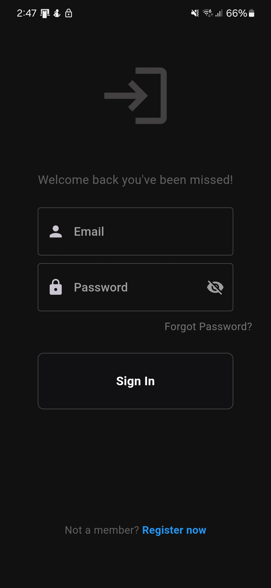

# Concert Capture (Android/IOS)

### Contents

[Overview](#contents)
[Usage](#usage)
[Data Storage](#data-storage)

## Overview
Concert Capture is a mobile application designed for Android/IOS currently in beta. Its goal is to facilitate the work of individuals who take notes on how many concerts or festivals they attend. The application allows the cloud-based storage of this data, provides feedback on the user's habits, and presents essential information to the user through diagrams.

## Usage

After installing the application, users have the option to either register a new account or log in if they already have a registered account. To register, a 6-character password sequence is required, containing both lowercase and uppercase letters, numbers, and special characters.

1. Registration/Login

2. Home Page

After registration, the user is greeted with the home screen, which initially contains no information. To change the content of the home screen, users need to record new or previous events using the + button. In the home screen, the upcoming events and recently attended artists are displayed in the V1.0.4 update.

3. Concerts

This section displays the recorded concerts. Users can search, create, modify, or delete events.

## Data Storage

Data is stored in the Firebase system provided by Google. We have access to the user's email address and recorded events. We cannot release or transmit the data to a third party. Users have the option to delete their events and accounts, which can be done in the Settings/Account menu.