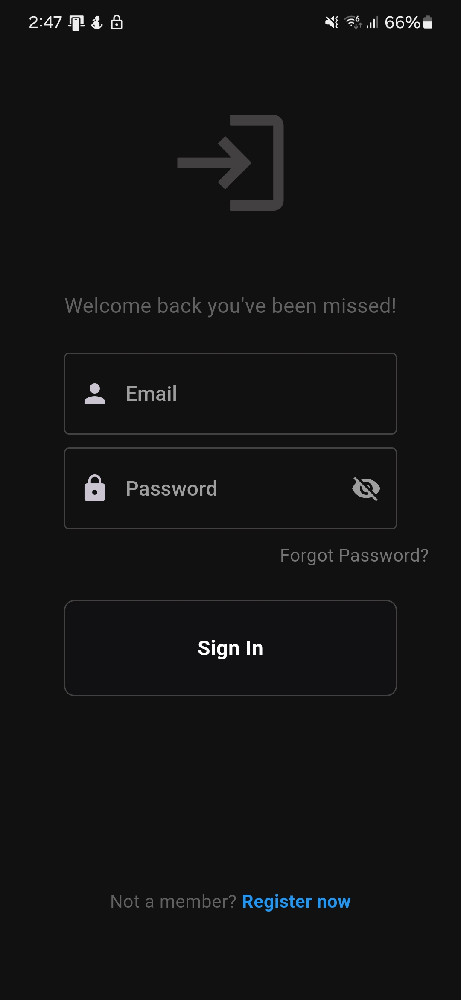

# Concert Capture (Android/IOS)

## Ismertető

A **Concert Capture** egy ***béta*** állapotban lévő **Android/IOS** rendszerre készült mobilalkalmazás. Célja, hogy azon személyek, akik jegyzetelik, hogy hány koncerten, fesztiválon vettek részt, megkönnyítse a munkályukat. Az alkalmazás lehetővé teszi ezen adatok felhőalapú tárolását, visszajelzést nyújt a felhasználó szokásairól, diagrammokon keresztül ismerteti a lényeges információkat a felhasználóval.

## Használata

Az alkalmazás telepítése után a felhasználónak lehetősége van új fiókot regisztrálni, illetve ha rendelkezik egy regisztrált fiókkal, akkor belépni.

1. Regisztráció/Bejelentkezés

