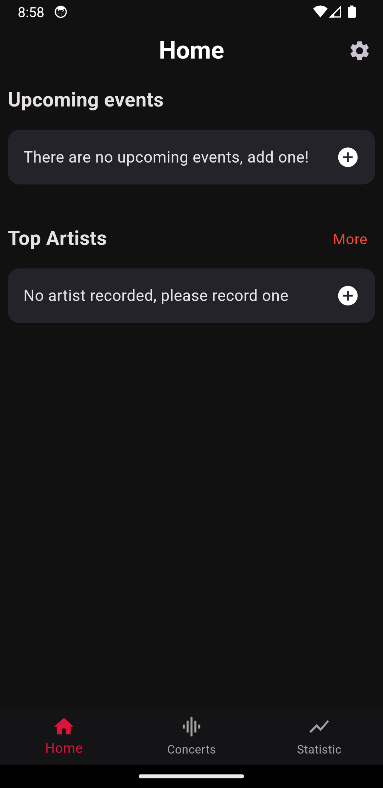

# Concert Capture (Android/IOS)

### Tartalom

- [Ismertető](#ismertető)
- [Használata](#használata)
- [Adattárolás](#adattárolás)

## Ismertető

A **Concert Capture** egy ***béta*** állapotban lévő **Android/IOS** rendszerre készült mobilalkalmazás. Célja, hogy azon személyek, akik jegyzetelik, hogy hány koncerten, fesztiválon vettek részt, megkönnyítse a munkályukat. Az alkalmazás lehetővé teszi ezen adatok felhőalapú tárolását, visszajelzést nyújt a felhasználó szokásairól, diagrammokon keresztül ismerteti a lényeges információkat a felhasználóval.

## Használata

Az alkalmazás telepítése után a felhasználónak lehetősége van új fiókot regisztrálni, illetve ha rendelkezik egy regisztrált fiókkal, akkor belépni. Regisztrációhoz egy 6 karakterből álló jelszósorozatra lesz szükség, mely tartalmaz kis és nagybetűt, számot és speciális karaktert.

1. Regisztráció/Bejelentkezés

2. Kezdőlap

Regisztráció után a kezdőképernyő fogadja a felhasználót, mely alap esetben nem tartlmaz információkat. Ahhoz, hogy a kezdőképernyő tartalma megváltozzon, szükségünk van rögzíteni új vagy korábbi eseményeket. Ezt a **+** gombbal teheti meg a felhasználó. A kezdőképernyőn a **V1.0.4**-es frissítésben megjelennek a közelgő események, halgotott előadóink.

3. Koncertek

Itt jelennek meg a rögzített koncertek. A felhasználónak lehetősége van keresni, létrehozni, módosítani vagy törölni eseményeket.

## Adattárolás

Az adatokat a Google által szolgáltatott Firebase rendszerben tároljuk. Hozzáférünk a felhasználó e-mail címéhez és rögzített eseményeihez. Az adatokat nem áll módunkban kiadni és közvetíteni harmadik fél számára. A felhasználónak lehetősége van eseményeinek és fiókjának törléséhez, mely a **Settings/Account** menüpontban található.